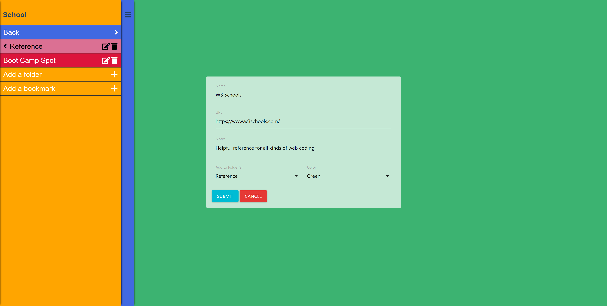

# Bookmark-Manager

## Description

This is a basic bookmark manager. It allows users to organize bookmarks into folders, and catagorize them with colors. It also includes a Chrome browser extension for adding bookmarks.

[This application is deployed here.](https://jdj-bookmark-man.herokuapp.com/)

## Table of Contents

* [Installation](#installation)
* [Usage](#usage)
* [User Story](#user-story)
* [Contributing](#contributing)
* [Future Development](#future-development)
* [Tests](#tests)
* [License](#license)
* [Questions](#questions)

## Installation

### Extension

1. Open the [chrome extension manager page](chrome://extensions)
2. Enable developer mode
3. Click on `Load unpacked` and select the `extension` directory in this repository
4. Select the extensions (puzzle piece) icon in the top right of your browser and pin bookmark manager

### Web Server

1. Open integrated terminal or enter the following into your console
2. Run `"npm i"`
3. Create a database
4. Create `.env` file w/ `DATABASE_URL` and `SESSION_SECRET` keys

## Usage

[Checkout my deployed app here](https://jdj-bookmark-man.herokuapp.com/)

or install and

1. Run `npm start`
2. Navigate to localhost:8080

## Contributing

Feel free to fork/pull. Use descriptive comments and commit messages.

## Future Development

* [Wire-Frame](public/assets/imgs/wire-frame.png)
* Circular Menu
* SVG Shapes
* Token-based Authentication
* Tag functionality

## Tests

Simply test it by running it and adding folders and bookmarks to make certain of functionality.

## Credits

* [Multi-level push menu](https://multi-level-push-menu.dzunic.net/)
* [Bookmark silhouette SVG](https://www.svgrepo.com/svg/138102/bookmark-silhouette-variant)

### Project created with:
* [Mark](https://github.com/mtrupiano)
* [Kevin](https://github.com/Kray93)
* [Zach](https://github.com/Z1springer)

[Check out our original code here](https://github.com/Kray93/Bookmark-Manager/tree/main), [and our deployed application here](https://bookmark-man.herokuapp.com/)

## License

[MIT License](https://opensource.org/licenses/MIT)

A short and simple permissive license with conditions only requiring preservation of copyright and license notices. Licensed works, modifications, and larger works may be distributed under different terms and without source code.

## Questions

If you have questions take a look at my GitHub

[JohnDJake](https://github.com/JohnDJake)

Or send me an email

[john.d.jake@gmail.com](mailto:john.d.jake@gmail.com)